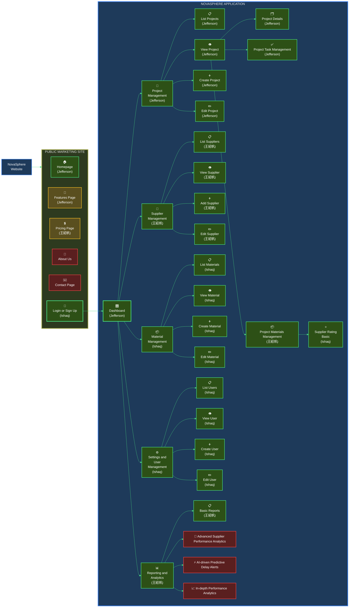

# 114 - HW4 - CT5805701 - Software Engineering

## Student Information
| Name | Student ID |
|------|-------------|
| ISHAQ ADHELTYO | M11402805 |
| 王紹帆 | M11405505 |
| CORNELIUS JEFFERSON TJAHJONO | M11405806 |

## Organization Chart of Planned Website

- 🟢 **High Priority (MVP - Phase 1)**  
  Green boxes: core features required for basic system operation.

- 🟡 **Medium Priority (Phase 2)**  
  Yellow boxes: features that enhance user experience and system completeness.

- 🔴 **Low Priority (Phase 3)**
  Red boxes: advanced AI-driven analytics and reporting features.

---

# Novasphere Application - Technical Documentation

A full-stack web application for managing construction suppliers, built with Express.js, MySQL, and Bootstrap 5.

## Tech Stack

- **Backend**: Express.js (Node.js)
- **Frontend**: HJS (Hogan.js templating), Bootstrap 5, HTMX
- **Database**: MySQL 8.0
- **Session Management**: express-session with cookies
- **Authentication**: bcrypt for password hashing

## Prerequisites

- Node.js >= 18.x
- npm >= 9.x
- Docker and Docker Compose (for containerized setup)
- MySQL 8.0 (for local development without Docker)

## Project Structure

```
novasphere/
├── src/
│   ├── config/              # Configuration files
│   ├── controllers/         # Base controller class
│   ├── middlewares/         # Authentication middleware
│   ├── modules/             # Feature modules
│   ├── repositories/        # Database Repo
│   ├── routes/              # Main router
│   ├── script/              # Migration and seed scripts
│   ├── services/            # Business logic services
│   ├── utils/               # Utility functions
│   ├── views/               # HJS templates
│   ├── public/              # Static assets (css, js, images)
│   └── index.js             # Main application entry
├── documentation/           # ERD and use case diagrams
└── docker-compose files     # Docker configurations
```

## Installation

### Option 1: Default Docker Setup (Recommended)

The simplest way to get started with the application.

1. **Build and start containers**
   ```bash
   docker compose up -d
   ```

2. **Access the application**
   - URL: http://localhost:20255

### Option 2: Local Development (with Docker for MySQL only)

For developers who want to run the Node.js app locally while using Docker for MySQL.

1. **Install dependencies**
   ```bash
   npm install
   ```

2. **Start MySQL container**
   ```bash
   docker compose -f docker-compose-local.yml up -d
   ```

3. **Configure environment**
   - The `.env` file is already configured
   - Update database credentials if needed

4. **Run migrations and seeds**
   ```bash
   npm run migrate
   npm run seed
   ```

5. **Start the application**
   ```bash
   npm run dev
   ```

6. **Access the application**
   - URL: http://localhost:3000
   - Default credentials: `admin@example.com` / `admin123`

### Option 3: Full Docker Development Environment

For development with hot-reload enabled inside Docker.

1. **Build and start containers**
   ```bash
   docker compose -f docker-compose-dev.yml up --build
   ```

2. **Access the container and run migrations**
   ```bash
   docker exec -it novasphere-app-dev sh
   npm run migrate
   npm run seed
   exit
   ```

3. **Access the application**
   - URL: http://localhost:3000
   - Default credentials: `admin@example.com` / `admin123`

## Available Scripts

- `npm start` - Start the application in production mode
- `npm run dev` - Start the application in development mode with watch
- `npm run migrate` - Run database migrations
- `npm run seed` - Seed the database with initial data
- `npm run etl` - Run ETL script to load TSV data
- `npm run db:reset` - Reset database (migrate + seed)
- `npm run db:full-reset` - Full database reset (migrate + seed + ETL)
- `npm run lint` - Run ESLint
- `npm run lint:fix` - Fix ESLint issues
- `npm run format` - Format code with Prettier
- `npm run format:check` - Check code formatting

## ETL Process

The application includes an ETL (Extract, Transform, Load) script to import data from TSV files into the database.

### TSV Files Required

1. **companies.tsv** - Contains company/supplier information (500 records)
2. **materials.tsv** - Contains material catalog with units and pricing (458 records)
3. **transactions.tsv** - Contains transaction history (51,947 records)

### Running the ETL Script

**Prerequisites:**
- Database must be migrated and seeded first
- TSV files must be present at the expected location

**Steps:**

1. **Reset database with base data**
   ```bash
   npm run db:reset
   ```

2. **Run ETL script**
   ```bash
   npm run etl
   ```

3. **Or run all in sequence**
   ```bash
   npm run db:full-reset
   ```

### What the ETL Script Does

1. **Seeds Material Categories**: Creates 7 categories (Products, Equipment, Machinery, Labor types, Other)

2. **Loads Suppliers**: Imports company data from `companies.tsv` into the `suppliers` table
   - Maps company information to supplier records
   - Validates required fields (name, email, phone, address)
   - Skips duplicates based on supplier name

3. **Loads Materials**: Imports materials from `materials.tsv` into the `materials` table
   - **Filters out** materials with unit="Day" or unit="Hour" (labor services)
   - Auto-categorizes materials based on item names
   - Associates materials with normalized unit lookup table
   - Excludes ~22 materials with Day/Hour units

4. **Creates Projects by Year**: Generates one project per year from transaction dates
   - Project naming: "Import Project YYYY"
   - Date range: Based on transaction data (1959-2025)
   - Sets all projects to "In Progress" status

5. **Loads Material Requirements**: Imports transactions into `project_material_requirements`
   - Maps transactions to appropriate projects by year
   - Links materials and suppliers using name matching
   - Associates normalized units from lookup table
   - Sets all requirements to "Delivered" status
   - Records quantity, price, and transaction date

### Unit Normalization

The ETL script normalizes unit names from the TSV files:
- **Piece** / **piece** → **Piece**
- **One test** / **one test** → **One Test**
- Other units preserved as-is

Units available: 900㎠, Bag, B.㎥, C.㎥, kg, km, L, L.㎥, m, m², ㎥, Metric Ton, One Test, Pair, Piece, root, Set, Trip

### ETL Output

After successful execution, you'll see a summary:
```
=== ETL Summary ===
Material Categories      : 7 records
Suppliers                : 500 records
Materials                : 436 records
Units                    : 18 records
Projects                 : 67 records
Material Requirements    : ~51,000 records
```

### Troubleshooting ETL

**File not found error:**
- Verify TSV files exist in the correct directory
- Check file permissions
- Ensure path is correct: `../ntust-graduate-ece-114-CT5805701-assignment-3/novasphere-files/`

**Duplicate key error:**
- Run `npm run db:reset` before ETL
- ETL script checks for duplicates but requires clean slate

**Foreign key constraint error:**
- Ensure seed script ran successfully
- Check that lookup tables (statuses, units, categories) are populated
- Verify `npm run seed` completed without errors

**Performance notes:**
- ETL processes ~52,000 transactions
- Progress updates shown every 5,000 records
- Typical execution time: 5-10 minutes depending on system

### ETL Data Mapping

| TSV File | Database Table | Key Mappings |
|----------|---------------|--------------|
| companies.tsv | suppliers | company_id preserved as reference, name/email/phone/address mapped |
| materials.tsv | materials | material_id preserved, Item → name, auto-categorized into 7 categories |
| materials.tsv | project_material_requirement_units | Unit extracted and normalized (18 unique units, excluding Day/Hour) |
| transactions.tsv | projects | Year extracted → "Import Project YYYY" (one project per year) |
| transactions.tsv | project_material_requirements | All transaction fields mapped, status set to Delivered, unit linked via lookup |

### Database Schema Changes

The ETL implementation includes a new normalized units system:

**New Table**: `project_material_requirement_units`
- `unit_id` (PK)
- `name` (UNIQUE)
- `is_active`, timestamps, soft delete fields

**Modified Table**: `project_material_requirements`
- **Before**: `unit VARCHAR(50)` (free text)
- **After**: `unit_id INT` (FK to project_material_requirement_units)

This normalization ensures data consistency and provides dropdown selection in the UI.

## Environment Variables

```env
# Application
NODE_ENV=development
PORT=3000
APP_NAME=Novasphere

# Database
DB_HOST=localhost
DB_PORT=3306
DB_USER=root
DB_PASSWORD=password
DB_NAME=novasphere_db

# Session
SESSION_SECRET=novasphere-secret-key-development-only
SESSION_MAX_AGE=86400000
```

## Default Login Credentials

- **Email**: admin@example.com
- **Password**: admin123

## Docker Commands

### Default Setup
```bash
# Start all services
docker compose up -d

# Stop all services
docker compose down

# View logs
docker compose logs -f

# Rebuild
docker compose up --build --force-recreate

# Remove volumes (for clean reset)
docker compose down -v
```

### Local MySQL Only
```bash
# Start MySQL
docker compose -f docker-compose-local.yml up -d

# Stop MySQL
docker compose -f docker-compose-local.yml down

# View logs
docker compose -f docker-compose-local.yml logs -f

# Remove volumes
docker compose -f docker-compose-local.yml down -v
```

### Full Development Environment
```bash
# Start all services
docker compose -f docker-compose-dev.yml up --build

# Stop all services
docker compose -f docker-compose-dev.yml down

# View logs
docker compose -f docker-compose-dev.yml logs -f app

# Rebuild
docker compose -f docker-compose-dev.yml up --build --force-recreate

# Remove volumes
docker compose -f docker-compose-dev.yml down -v
```

## Code Style

This project uses:
- **ESLint** for code linting
- **Prettier** for code formatting
- **2 spaces** for indentation
- **ESM modules** (import/export)
- **Class-based** architecture

## Before Committing

Before committing your changes, always run these commands in order:

1. **Check code formatting**
   ```bash
   npm run format:check
   ```

2. **Format code**
   ```bash
   npm run format
   ```

3. **Lint code**
   ```bash
   npm run lint
   ```

### Commit Message Convention

Follow the [Conventional Commits](https://www.conventionalcommits.org/) specification:

```
<type>(<scope>): <description>

[optional body]

[optional footer(s)]
```

**Types:**
- `feat`: A new feature
- `fix`: A bug fix
- `docs`: Documentation only changes
- `style`: Changes that don't affect code meaning (whitespace, formatting)
- `refactor`: Code change that neither fixes a bug nor adds a feature
- `perf`: Performance improvements
- `test`: Adding or updating tests
- `chore`: Changes to build process or auxiliary tools

**Examples:**
```bash
git commit -m "feat(auth): add login functionality"
git commit -m "fix(dashboard): resolve project count calculation"
git commit -m "docs(readme): update installation instructions"
git commit -m "refactor(services): simplify user service methods"
git commit -m "chore(deps): update express to v4.18.0"
```

## Import Strategy

The project uses **relative imports** throughout the codebase for maximum compatibility with Node.js ESM:

```javascript
// From src/index.js
import appConfig from './config/app/index.js';
import databaseService from './services/database/index.js';

// From src/modules/auth/service.js
import userRepository from '../../repositories/user/index.js';
```

## Development Guidelines

1. **Follow the repository pattern** - All database queries go through repositories
2. **Use services for business logic** - Controllers should be thin
3. **Validate input** - Use the BaseService `validateRequired` method
4. **Handle errors properly** - Use try-catch blocks and proper error messages
5. **Keep views simple** - Minimal logic in templates

## Troubleshooting

### Port already in use
```bash
# Find process using port 3000
lsof -i :3000
# Kill the process
kill -9 <PID>
```

### Database connection refused
- Ensure MySQL container is running: `docker ps`
- Check database credentials in `.env`
- Verify MySQL is accessible: `docker-compose -f docker-compose-local.yml logs mysql`

### Migration errors
```bash
# Reset the database
docker-compose -f docker-compose-local.yml down -v
docker-compose -f docker-compose-local.yml up -d
npm run migrate
npm run seed
```