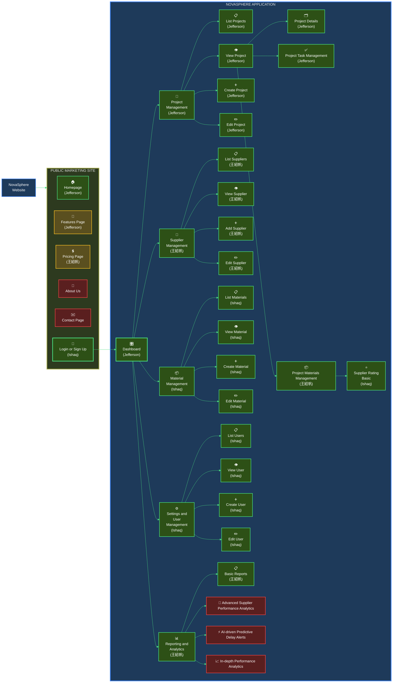

# 114 - HW4 - CT5805701 - Software Engineering

## Student Information
| Name | Student ID |
|------|-------------|
| ISHAQ ADHELTYO | M11402805 |
| 王紹帆 | M11405505 |
| CORNELIUS JEFFERSON TJAHJONO | M11405806 |

## Organization Chart of Planned Website

- 🟢 **High Priority (MVP - Phase 1)**  
  Green boxes: core features required for basic system operation.

- 🟡 **Medium Priority (Phase 2)**  
  Yellow boxes: features that enhance user experience and system completeness.

- 🔴 **Low Priority (Phase 3)**
  Red boxes: advanced AI-driven analytics and reporting features.

---

# Novasphere Application - Technical Documentation

A full-stack web application for managing construction suppliers, built with Express.js, MySQL, and Bootstrap 5.

## Tech Stack

- **Backend**: Express.js (Node.js)
- **Frontend**: HJS (Hogan.js templating), Bootstrap 5, HTMX
- **Database**: MySQL 8.0
- **Session Management**: express-session with cookies
- **Authentication**: bcrypt for password hashing

## Prerequisites

- Node.js >= 18.x
- npm >= 9.x
- Docker and Docker Compose (for containerized setup)
- MySQL 8.0 (for local development without Docker)

## Project Structure

```
novasphere/
├── src/
│   ├── config/              # Configuration files
│   ├── controllers/         # Base controller class
│   ├── middlewares/         # Authentication middleware
│   ├── modules/             # Feature modules
│   ├── repositories/        # Database Repo
│   ├── routes/              # Main router
│   ├── script/              # Migration and seed scripts
│   ├── services/            # Business logic services
│   ├── utils/               # Utility functions
│   ├── views/               # HJS templates
│   ├── public/              # Static assets (css, js, images)
│   └── index.js             # Main application entry
├── documentation/           # ERD and use case diagrams
└── docker-compose files     # Docker configurations
```

## Installation

### Option 1: Local Development (with Docker for MySQL only)

1. **Install dependencies**
   ```bash
   npm install
   ```

2. **Start MySQL container**
   ```bash
   docker-compose -f docker-compose-local.yml up -d
   ```

3. **Configure environment**
   - The `.env` file is already configured
   - Update database credentials if needed

4. **Run migrations and seeds**
   ```bash
   npm run migrate
   npm run seed
   ```

5. **Start the application**
   ```bash
   npm run dev
   ```

6. **Access the application**
   - URL: http://localhost:3000
   - Default credentials: `admin@example.com` / `admin123`

### Option 2: Full Docker Development Environment

1. **Build and start containers**
   ```bash
   docker-compose -f docker-compose-dev.yml up --build
   ```

2. **Access the container and run migrations**
   ```bash
   docker exec -it novasphere-app-dev sh
   npm run migrate
   npm run seed
   exit
   ```

3. **Access the application**
   - URL: http://localhost:3000
   - Default credentials: `admin@example.com` / `admin123`

## Available Scripts

- `npm start` - Start the application in production mode
- `npm run dev` - Start the application in development mode with watch
- `npm run migrate` - Run database migrations
- `npm run seed` - Seed the database with initial data
- `npm run db:reset` - Reset database (migrate + seed)
- `npm run lint` - Run ESLint
- `npm run lint:fix` - Fix ESLint issues
- `npm run format` - Format code with Prettier
- `npm run format:check` - Check code formatting

## Environment Variables

```env
# Application
NODE_ENV=development
PORT=3000
APP_NAME=Novasphere

# Database
DB_HOST=localhost
DB_PORT=3306
DB_USER=root
DB_PASSWORD=password
DB_NAME=novasphere_db

# Session
SESSION_SECRET=novasphere-secret-key-development-only
SESSION_MAX_AGE=86400000
```

## Default Login Credentials

- **Email**: admin@example.com
- **Password**: admin123

## Docker Commands

### Local MySQL Only
```bash
# Start MySQL
docker-compose -f docker-compose-local.yml up -d

# Stop MySQL
docker-compose -f docker-compose-local.yml down

# View logs
docker-compose -f docker-compose-local.yml logs -f
```

### Full Development Environment
```bash
# Start all services
docker-compose -f docker-compose-dev.yml up --build

# Stop all services
docker-compose -f docker-compose-dev.yml down

# View logs
docker-compose -f docker-compose-dev.yml logs -f app

# Rebuild
docker-compose -f docker-compose-dev.yml up --build --force-recreate
```

## Code Style

This project uses:
- **ESLint** for code linting
- **Prettier** for code formatting
- **2 spaces** for indentation
- **ESM modules** (import/export)
- **Class-based** architecture

## Import Strategy

The project uses **relative imports** throughout the codebase for maximum compatibility with Node.js ESM:

```javascript
// From src/index.js
import appConfig from './config/app/index.js';
import databaseService from './services/database/index.js';

// From src/modules/auth/service.js
import userRepository from '../../repositories/user/index.js';
```

## Development Guidelines

1. **Follow the repository pattern** - All database queries go through repositories
2. **Use services for business logic** - Controllers should be thin
3. **Validate input** - Use the BaseService `validateRequired` method
4. **Handle errors properly** - Use try-catch blocks and proper error messages
5. **Keep views simple** - Minimal logic in templates

## Troubleshooting

### Port already in use
```bash
# Find process using port 3000
lsof -i :3000
# Kill the process
kill -9 <PID>
```

### Database connection refused
- Ensure MySQL container is running: `docker ps`
- Check database credentials in `.env`
- Verify MySQL is accessible: `docker-compose -f docker-compose-local.yml logs mysql`

### Migration errors
```bash
# Reset the database
docker-compose -f docker-compose-local.yml down -v
docker-compose -f docker-compose-local.yml up -d
npm run migrate
npm run seed
```