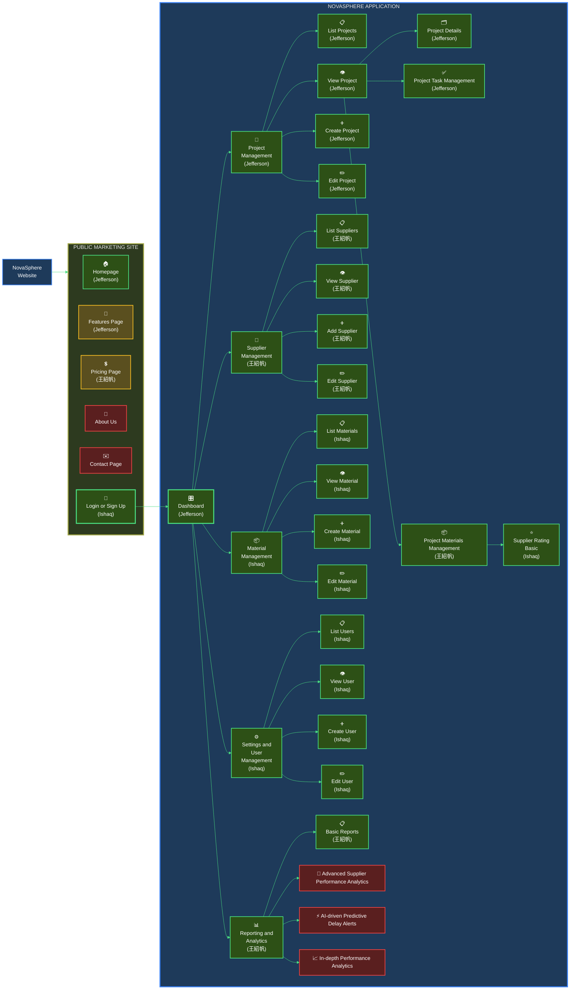

# 114 - HW4 - CT5805701 - Software Engineering

## Student Information
| Name | Student ID |
|------|-------------|
| ISHAQ ADHELTYO | M11402805 |
| 王紹帆 | M11405505 |
| CORNELIUS JEFFERSON TJAHJONO | M11405806 |

## Organization Chart of Planned Website

- 🟢 **High Priority (MVP - Phase 1)**  
  Green boxes: core features required for basic system operation.

- 🟡 **Medium Priority (Phase 2)**  
  Yellow boxes: features that enhance user experience and system completeness.

- 🔴 **Low Priority (Phase 3)**  
  Red boxes: advanced AI-driven analytics and reporting features.