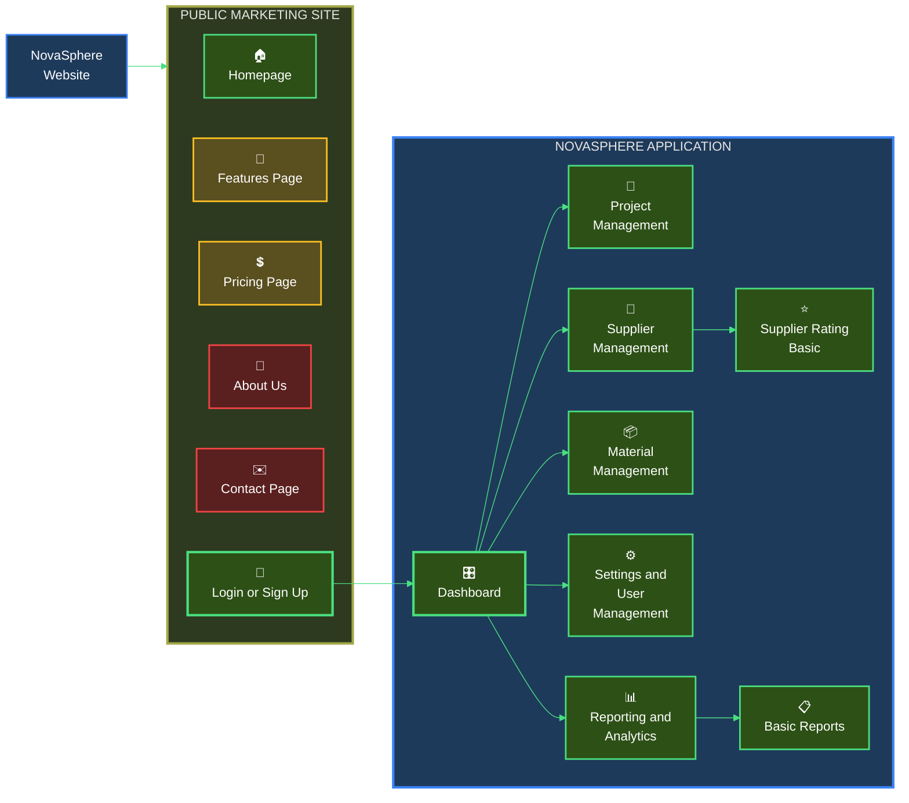

# Novasphere - Construction Supplier Management System Website

## Organization Chart of Planned Website

## Implementation Priority
- **High Priority: 🟩 Green Color**
- **Medium Priority: 🟨 Yellow Color**
- **Low Priority: 🟥 Red Color**

## Organization Chart Explanation - Website Features
**Public Marketing Site**
- 🏠Homepage (Landing Page)
- 📄Features Page (Service Explanation)
- 💲Pricing Page (Subscription Tiers)
- 👤About Us (Trinova Company)
- ✉️Contact Page
- 🔐Login or Sign Up (Access the Novasphere Application Section)

**Novasphere Application (Logged-In)**
- 🎛️Dashboard (Main User Entry Point and Project Overview)
- 📁Project Management
  - View All Projects
  - Create/Edit Project
  - Project Details (Tasks, Members, etc.)
  - Track Project Progress
- 🏢Supplier Management
  - View All Suppliers
  - Add/Edit Suppliers
  - Suppliers Detail
  - ⭐Supplier Rating Basic
  - Review Supplier Performance
- 📦Material Management
  - View Material Requirements
  - Track Ordering & Delivery
  - Verify Material Quality
- ⚙️Settings and User Management
  - User Profile
  - Manage Employee Accounts (Administrator)
  - Assign Roles & Permissions (Administrator)
- 📊Reporting and Analytics
  - 📋Basic Reports
 
## Project Development Responsibility
- **Ishaq:**
- **王紹帆/Frank:**
- **Cornelius:**
