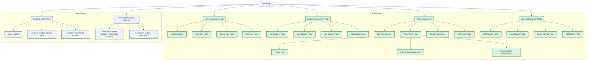

```mermaid
graph TD
    A[Homepage]

    subgraph "MVP Features"
        B(User Management Page)
        B_List[List Users Page]
        B_View[View User Page]
        B_Create[Create User Page]
        B_Edit[Edit User Page]

        C(Supplier Management Page)
        C_List[List Suppliers Page]
        C_View[View Supplier Page]
        C_Create[Add Supplier Page]
        C_Edit[Edit Supplier Page]

        D(Project Management)
        D_List[List Projects Page]
        D_View[View Project Page]
        D_View_Project_Form[Project Form]
        D_View_Project_Task[Project Task Management]
        D_View_Project_Material[Project Material Management]
        D_Create[Create Project Page]
        D_Edit[Edit Project Page]

        E(Material Management Page)
        E_List[List Materials Page]
        E_View[View Material Page]
        E_Create[Create Material Page]
        E_Edit[Edit Material Page]
    end

    subgraph "Full Features"
        G(Reporting and Analytics)
        G_Basic[Basic Reports]
        G_AI[AI-driven Predictive Delay Alerts]
        G_Analytics[In-depth Performance Analytics]

        H(Advanced Supplier Analytics)
        H_Perf[Generate Advanced Supplier Performance Analytics]
        H_Bench[Benchmark Supplier Performance]
    end

    A --> B
    A --> C
    A --> D
    A --> E
    A --> G
    A --> H

    B --> B_List
    B --> B_View
    B --> B_Create
    B --> B_Edit

    C --> C_List
    C --> C_View
    C --> C_Create
    C --> C_Edit

    D --> D_List
    D --> D_View
    D_View --> D_View_Project_Form
    D_View --> D_View_Project_Task
    D_View --> D_View_Project_Material
    D --> D_Create
    D --> D_Edit

    E --> E_List
    E --> E_View
    E --> E_Create
    E --> E_Edit

    G --> G_Basic
    G --> G_AI
    G --> G_Analytics

    H --> H_Perf
    H --> H_Bench

    classDef mvp fill:#D5F5E3,stroke:#1D8348,stroke-width:2px;
    classDef full fill:#EAF2F8,stroke:#2874A6,stroke-width:2px;

    class B,B_List,B_View,B_Create,B_Edit mvp
    class C,C_List,C_View,C_Create,C_Edit mvp
    class D,D_List,D_View,D_View_Project_Form,D_View_Project_Task,D_View_Project_Material,D_Create,D_Edit mvp
    class E,E_List,E_View,E_Create,E_Edit,E_Track mvp
    class G,G_Basic,G_AI,G_Analytics full
    class H,H_Perf,H_Bench full
```